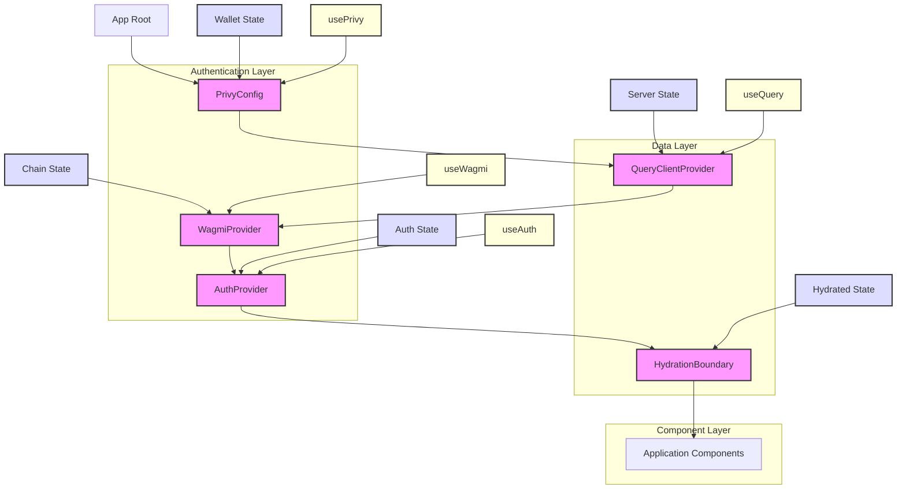
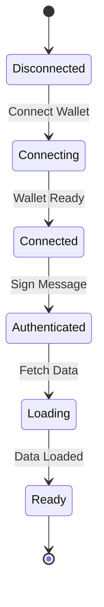
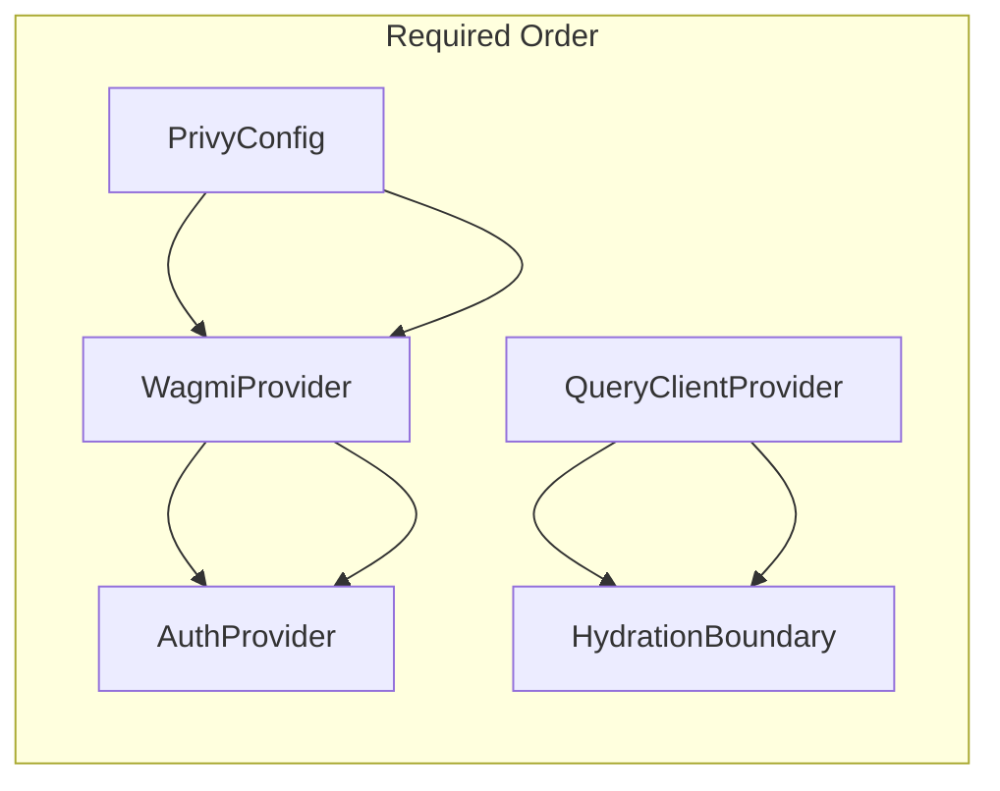

# Provider Architecture Diagram



## Data Flow

1. **Authentication Flow**

   ```mermaid
   sequenceDiagram
       participant U as User
       participant P as PrivyConfig
       participant W as WagmiProvider
       participant A as AuthProvider

       U->>P: Connect Wallet
       P->>W: Update Chain State
       W->>A: Update Auth State
       A->>U: Connected State
   ```

2. **Data Fetching Flow**

   ```mermaid
   sequenceDiagram
       participant C as Component
       participant Q as QueryClientProvider
       participant H as HydrationBoundary
       participant S as Server

       C->>Q: Request Data
       Q->>S: Fetch Data
       S->>H: Return Data
       H->>C: Hydrated Data
   ```

## State Management



## Provider Dependencies


